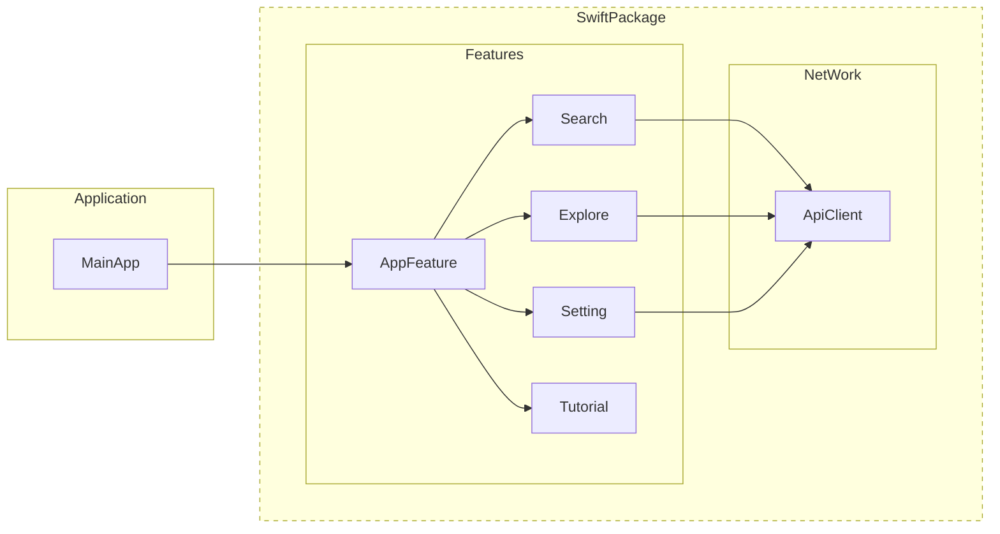

# SwiftUIModularizedArchitecture(12/21~)

## Referred to modularized architecture in [pointfreeco/isowords](https://github.com/pointfreeco/isowords)

## Dependency diagram(編集中)

```mermaid
flowchart LR
    classDef Application fill:none,stroke:none
    classDef SwiftPackage fill:none,stroke:none
    classDef Features fill:none,stroke:none
    classDef NetWork fill:none,stroke:none

    MainApp --> AppFeature
    subgraph Application
        subgraph Application_frame [ ]
            MainApp
        end
    end
    
    subgraph SwiftPackage
    style SwiftPackage stroke-dasharray: 5 5

        subgraph SwiftPackage_frame[ ]
        
        Search --> ApiClient
        Explore --> ApiClient
        Setting --> ApiClient

            subgraph Features
                subgraph Features_frame [ ]
                    AppFeature --> Tutorial
                    AppFeature --> Search
                    AppFeature --> Explore
                    AppFeature --> Setting
                end
            end

            subgraph NetWork
                subgraph NetWork_frame [ ]
                    ApiClient
                end
            end
        end
    end
    
    class Application_frame Application
    class SwiftPackage_frame SwiftPackage
    class Features_frame Features
    class NetWork_frame NetWork
```
