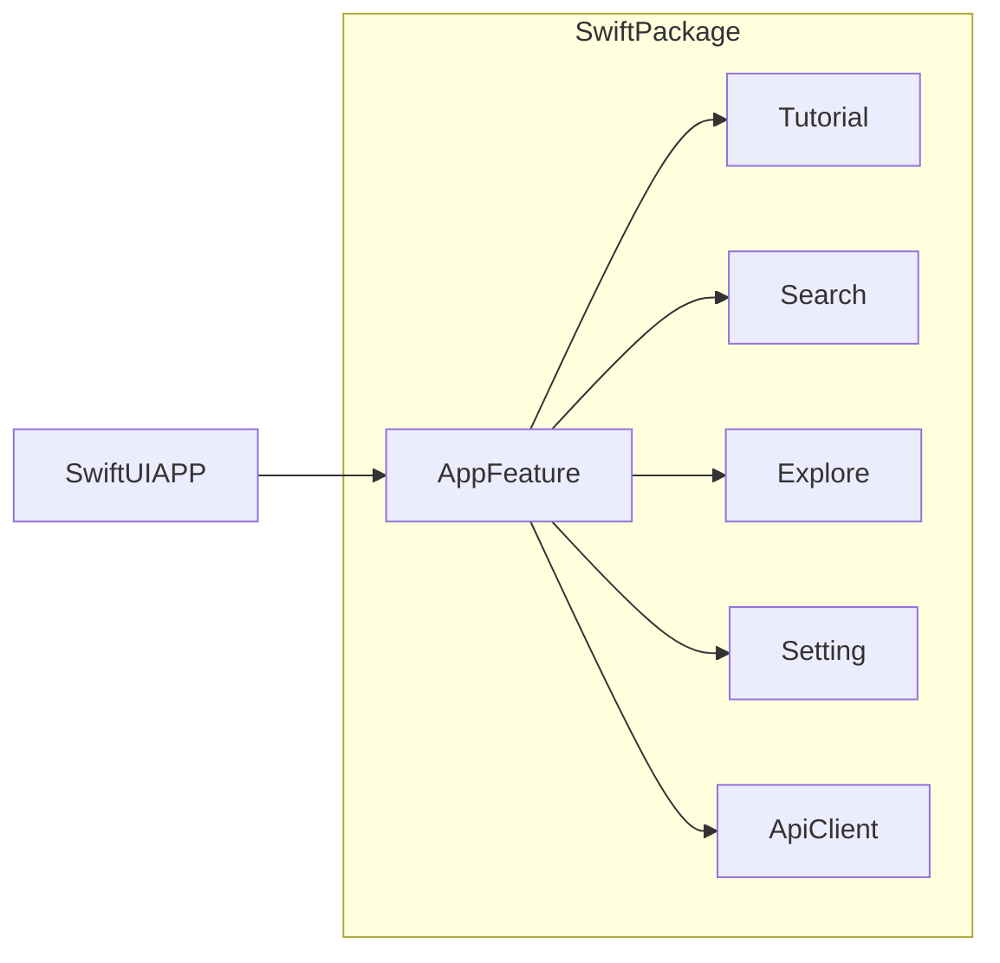

# SwiftUIModularizedArchitecture(12/21~)

## Dependency diagram(編集中)

```mermaid
flowchart LR
  SwiftUIAPP --> AppFeature
 
    subgraph SwiftPackage
    direction TB
        AppFeature --> Tutorial
        AppFeature --> Search
        AppFeature --> Explore
        AppFeature --> Setting
        AppFeature --> ApiClient
    end
```

